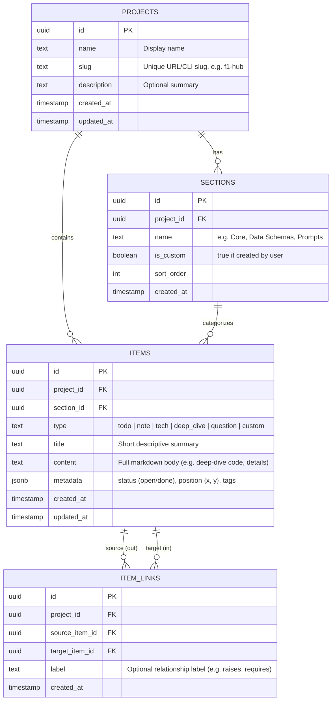

# Design Specification: Project Notes App (`notes-app`)

**Date:** 2026-09-25  
**Status:** Under Review  
**Project Path:** `c:/Users/mcheh/OneDrive/Desktop/Learning-AI/week-6/notes-app`  

---

## 1. Problem Statement & Goals

The user manages project notes across 11+ Learning-AI projects. Notes are currently fragmented across three places:
1. Tasks in Apple Reminders (phone)
2. Brainstorming notes in Notepad (laptop)
3. Raw text files within individual project repositories

Traditional bullet-point lists fail because the user is a visual learner. They require a single unified application where:
- Every Learning-AI project has its own dedicated visual workspace.
- Items inside each project (to-dos, technical deep-dives, technologies used, questions for AI, and notes) are **visually linked** to each other using arrows and flows.
- Accessible seamlessly on both **laptop** (interactive canvas) and **phone** (connected vertical stream).
- Both the user and AI assistants (**Claude** and **Gemini**) can read and write notes directly without compromising authentication credentials.

---

## 2. User Decisions & Design Principles (Ground Truth)

| Dimension | Decision | Rationale |
|---|---|---|
| **Location & Name** | `week-6/notes-app` | Standardized folder alongside other week-6 deliverables. |
| **Link Scope** | **Intra-project links only** | Links connect items inside a project to show workflow and context, not a confusing cross-project spiderweb. |
| **Link Ownership** | **User-curated by hand** | The user chooses what connects to what when adding or organizing items. |
| **Deep-dives** | **Owned by the originating project** | Lives where the technology was first learned (e.g., FastF1 in `week-1/F1Hub-project-Gemini`), not in a generic detached wiki. |
| **Multi-Agent Access** | **Equal support for Claude & Gemini** | Any AI running in a terminal or workspace can inspect notes and add to-dos/questions via a CLI tool. |
| **Tech Stack** | **React + Vite + Supabase + Cloudflare Pages** | Matches the proven architecture of Dina's Studio (`week-2/Dinas-studio`), including Supabase free-tier keep-alive. |
| **Custom Sections** | **Flexible custom sections per project** | Projects can define custom categories (e.g. Data Schemas, Model Architectures, Prompt Logs) beyond core sections. |
| **Migration** | **CLI import tool (`notes import`)** | Automated parsing of markdown text files with manual curation to preserve sanity. |
| **Deployment Rule** | **User pushes to remote** | AI commits locally and reports pending changes; Cloudflare Pages deploys on user git push. |

---

## 3. Data Architecture (Supabase / Postgres)

### 3.1 Entity Relationship Diagram



### 3.2 SQL Schema & Policies (`schema.sql`)

```sql
-- Enable UUID extension
create extension if not exists "uuid-ossp";

-- Projects table
create table public.projects (
    id uuid primary key default uuid_generate_v4(),
    user_id uuid references auth.users(id) on delete cascade not null,
    name text not null,
    slug text not null unique,
    description text default '',
    created_at timestamptz default timezone('utc'::text, now()) not null,
    updated_at timestamptz default timezone('utc'::text, now()) not null
);

-- Sections table
create table public.sections (
    id uuid primary key default uuid_generate_v4(),
    project_id uuid references public.projects(id) on delete cascade not null,
    name text not null,
    is_custom boolean default false not null,
    sort_order int default 0 not null,
    created_at timestamptz default timezone('utc'::text, now()) not null
);

-- Items table
create table public.items (
    id uuid primary key default uuid_generate_v4(),
    project_id uuid references public.projects(id) on delete cascade not null,
    section_id uuid references public.sections(id) on delete set null,
    type text not null check (type in ('todo', 'note', 'tech', 'deep_dive', 'question', 'custom')),
    title text not null,
    content text default '',
    metadata jsonb default '{}'::jsonb not null,
    created_at timestamptz default timezone('utc'::text, now()) not null,
    updated_at timestamptz default timezone('utc'::text, now()) not null
);

-- Item Links table (graph edges)
create table public.item_links (
    id uuid primary key default uuid_generate_v4(),
    project_id uuid references public.projects(id) on delete cascade not null,
    source_item_id uuid references public.items(id) on delete cascade not null,
    target_item_id uuid references public.items(id) on delete cascade not null,
    label text default '',
    created_at timestamptz default timezone('utc'::text, now()) not null,
    constraint unique_directed_link unique (source_item_id, target_item_id)
);

-- Indexes for rapid graph querying
create index idx_items_project on public.items(project_id);
create index idx_items_type on public.items(type);
create index idx_links_project on public.item_links(project_id);
create index idx_links_source on public.item_links(source_item_id);
create index idx_links_target on public.item_links(target_item_id);

-- Row Level Security (RLS)
alter table public.projects enable row level security;
alter table public.sections enable row level security;
alter table public.items enable row level security;
alter table public.item_links enable row level security;

-- Policies: Authenticated user owns their projects
create policy "Users manage their own projects" on public.projects
    for all using (auth.uid() = user_id);

create policy "Users manage sections of their projects" on public.sections
    for all using (project_id in (select id from public.projects where user_id = auth.uid()));

create policy "Users manage items of their projects" on public.items
    for all using (project_id in (select id from public.projects where user_id = auth.uid()));

create policy "Users manage links of their projects" on public.item_links
    for all using (project_id in (select id from public.projects where user_id = auth.uid()));
```

---

## 4. Visual Experience & UX (Laptop vs. Phone)

### 4.1 Laptop: Visual Infinite Canvas
* **Interaction**:
  * Pan and zoom canvas powered by `@xyflow/react` with custom styled nodes.
  * Node cards color-coded by item type:
    * `To-do`: Emerald (`#10B981`) with checkbox toggle.
    * `Tech`: Cyan (`#06B6D4`) with pill tags.
    * `Deep-Dive`: Indigo/Violet (`#8B5CF6`) with expand/modal markdown drawer.
    * `Question`: Amber (`#F59E0B`) with prompt badge.
    * `General Note`: Neutral Slate (`#64748B`).
  * Connecting handles on all node cards: click and drag connector to any other node to form an edge with optional label.
  * Drag node repositioning automatically persisted to `items.metadata.position` with debounced sync.
  * Quick-add floating palette (`Ctrl+K` or bottom action dock) to drop a new node right at the cursor position.

### 4.2 Phone: Adaptive Connected Stream
* **Interaction**:
  * Canvas pan/zoom is disabled on small viewports in favor of an optimized, high-density vertical stream.
  * Cards display incoming and outgoing connector chips:
    * `↳ Needed for: [To-do: Cache Telemetry]`
    * `↰ Raised by: [Question: SQLite vs Parquet]`
  * Tapping a connector chip smoothly scrolls the view and flashes the target card.
  * Quick-add bottom sheet with single-tap type selector and link picker dropdown.

---

## 5. Multi-Agent CLI Tool (`notes` CLI)

### 5.1 Architecture & Auth
* Lightweight CLI built with Node.js (`notes-app/cli/bin/notes.js`).
* Reads machine-global configuration from `~/.config/notes-app/config.json`:
  ```json
  {
    "supabase_url": "https://xyzcompany.supabase.co",
    "supabase_service_key": "eyJhbGciOi..."
  }
  ```
* Bypasses client-side user session by using Supabase Service Role API directly, ensuring:
  1. No personal user credentials are required in git.
  2. Any AI agent (Claude, Gemini) running in any project directory can query and append items with zero friction.

### 5.2 Command Specification

```bash
# Display summary of project items and links
notes list <project-slug> [--type todo|question|tech] [--format json]

# Add a question raised during an AI session
notes add-question <project-slug> "Can we cache telemetry locally?" --linked-to <item-id>

# Add a to-do item
notes add-todo <project-slug> "Implement SQLite cache driver" --linked-to <question-id>

# Add or update a technical deep-dive
notes add-deep-dive <project-slug> "FastF1 API Internals" --file ./docs/fastf1-internals.md

# Link two existing items
notes link <project-slug> <source-id> <target-id> [--label "requires"]

# Bulk import legacy notes from text file
notes import <project-slug> ./legacy-notes.txt
```

### 5.3 Agent Integration Contract
Added to `CLAUDE.md` and `GEMINI.md` across all Learning-AI projects:
```markdown
## Project Notes
This project is connected to the Notes App.
- List project notes: `notes list <project-slug>`
- Append questions: `notes add-question <project-slug> "<question>" [--linked-to <id>]`
- Append to-dos: `notes add-todo <project-slug> "<todo>" [--linked-to <id>]`
```

---

## 6. Migration of Legacy Notes (8 Selected Projects)

The `notes import <project-slug> <file-path>` command runs an intelligent parser:
1. `- [ ] <text>` or `* [ ] <text>` $\rightarrow$ Creates item `type: 'todo'`, `metadata.status = 'open'`.
2. `- [x] <text>` $\rightarrow$ Creates item `type: 'todo'`, `metadata.status = 'done'`.
3. `# Heading` or `## Heading` $\rightarrow$ Evaluates if heading represents a custom section or technical deep-dive.
4. Unchecked bullet points $\rightarrow$ Creates item `type: 'note'`.
5. Outputs a preview table for verification before writing records to Supabase.

The 8 curated projects to populate:
1. `week-1/Personal-Portfolio` (`personal-portfolio`)
2. `week-2/Dinas-studio` (`dinas-studio`)
3. `week-3/Automation-Pipeline-Project` (`automation-pipeline-project`)
4. `week-4/e-Invoicing-Project` (`e-invoicing-project`)
5. `week-5/Data-Science-Project` (`data-science-project`)
6. `week-5/F1-race-prediction` (`f1-race-prediction`)
7. `week-6/personal-dashboard` (`personal-dashboard`)
8. `week-6/notes-app` (`notes-app`)

---

## 7. Cloudflare Pages & Supabase Keep-Alive

* **Cloudflare Pages**:
  * Build command: `npm run build`
  * Output directory: `dist`
  * Single Page App (SPA) redirect rule in `public/_redirects`: `/* /index.html 200`
* **Supabase Free Tier Keep-Alive**:
  * GitHub Action `.github/workflows/keep-alive.yml` scheduled to run daily at 00:00 UTC.
  * Sends a lightweight `GET` request to `https://<supabase-url>/rest/v1/projects?select=count` with the API key, preventing project pausing.

---

## 8. Non-Goals

* **No cross-project spiderwebs**: Links stay cleanly scoped within each project.
* **No complex native app wrapper**: Web PWA on Cloudflare Pages is fast, responsive, and platform-agnostic.
* **No multi-user team collaboration**: Strictly single-owner personal learning platform with multi-agent API access.
* **No two-way file synchronization**: Supabase is the single source of truth; git files do not get overwritten by web edits.
